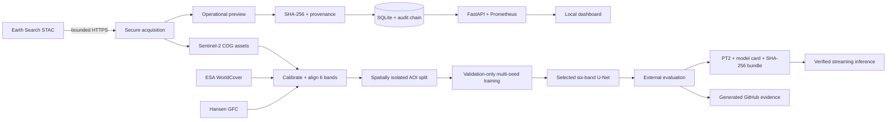

# Geospatial Vision Observatory v2


**Windows-native Sentinel-2 multispectral machine vision with reproducible training, spatially isolated evaluation, cryptographic provenance, and a local provenance and inference dashboard.**

Geospatial Vision Observatory is an end-to-end geospatial ML research and engineering showcase. It acquires real Copernicus Sentinel-2 L2A observations through STAC, calibrates and aligns multispectral Cloud-Optimized GeoTIFFs, trains a six-band semantic-segmentation model against ESA WorldCover reference labels, evaluates the selected model on geographically separate external AOIs, exports a content-verified deployment bundle, and exposes model and acquisition provenance through FastAPI.

**v2 adds the scaling and evidence foundation:** deterministic Polygon/MultiPolygon AOIs, projected processing cells, multi-reference raster execution, immutable resumable runs, lazy ML raster access, and experimental holdout-exposure governance while preserving AOIs as the scientific evidence unit. See [`CHANGELOG.md`](CHANGELOG.md) and [`docs/V2_RELEASE.md`](docs/V2_RELEASE.md).

The current measured model uses **red, green, blue, NIR, SWIR1, and SWIR2** reflectance. Forestry and urban performance are reported explicitly through tree-cover and built-up evaluation slices. Hansen Global Forest Change is retained as a forestry context layer rather than treated as temporally aligned single-date ground truth.

## Windows quick start

**No WSL, Bash, or Git Bash is required.** The canonical host environment is Windows 10/11 x64 with PowerShell and Python 3.14.

From PowerShell in the repository directory, the normal local path is one command:

```powershell
.\scripts\run_windows.cmd
```

For a short validation-only integration run:

```powershell
.\scripts\run_windows.cmd -Quick
```

The one-command launcher bootstraps or repairs the current extraction, resolves a usable curated-data cache, runs the scientific workflow, records research eligibility, and starts the API on an available loopback port.

Local execution separates **runtime correctness** from **publication/CI strictness**. Runtime syntax, dependency consistency, data/model integrity, training or inference failures, and unsafe network binding remain hard failures. Ruff, mypy, coverage, dependency audit, package-build checks, and research-showcase score thresholds are advisory for local operation and are enforced separately by `\.\scripts\quality.cmd -Strict`, deterministic release packaging, and GitHub CI.

`bootstrap.cmd` installs or repairs the editable project environment for the current extraction path and validates runtime prerequisites. `setup.cmd` creates the Python environment under `%USERPROFILE%\.gvo\venv-py314`, installs the pinned geospatial/ML runtime dependencies, verifies dependency consistency, and reports whether CUDA is available. Add `-WithDevTools` when you also want local lint, type, and test tooling installed up front. No environment activation is required.

Heavy curated rasters default to `%USERPROFILE%\.gvo\curated` rather than the repository directory. If Windows denies access to that cache, the one-command launcher automatically selects a fresh writable `%USERPROFILE%\.gvo\curated-windows*` fallback and leaves the inaccessible cache untouched. Override the data location with `-DataRoot D:\gvo-data` or the `GVO_DATA_ROOT` environment variable.

For an NVIDIA CUDA 13.0 PyTorch environment:

```powershell
.\scripts\bootstrap.cmd -TorchBackend Cuda130
.\scripts\showcase.cmd -Device cuda -SkipSetup
```

For a short non-publishable diagnostic that never fetches or evaluates the frozen Stockholm/Tallinn external holdout:

```powershell
.\scripts\showcase.cmd -Quick
```

## Measured model result

Measured model results are intentionally not pre-filled in this clean source checkout. Run the full Windows scientific workflow to generate model artifacts, evaluation evidence, and the release-gate decision from the configured data and code.

The continuing baseline lineage treats `stockholm_external` and `tallinn_external` as `external_observed` because their results have already been inspected during development. They must not be reused as supposedly untouched final holdouts for later model tuning. New publication-grade final evaluation requires new `external_unobserved` geography.

## What this repository demonstrates

| Area | Implemented evidence |
| --- | --- |
| Windows engineering | PowerShell-first setup, training, validation, Windows virtualenv paths, Windows GitHub Actions, and `.cmd` launchers |
| Geospatial data engineering | STAC discovery, remote COG windows, CRS-aware reprojection, Sentinel radiometric scale/offset handling, and SCL masking |
| Computer vision | compact six-band U-Net, class-weighted training, spatial patching, and streaming full-scene inference |
| Scientific evaluation | AOI-level split isolation, validation-only seed selection, external Stockholm/Tallinn evaluation, IoU/Dice/calibration metrics, and bootstrap CI |
| MLOps | deterministic run configuration, data and experiment signatures, PT2 model export, model card, release gate, and reusable inference CLI |
| Information integrity | SHA-256 identities for observations, curated outputs, source archive, and model bundles; chained audit records |
| Cybersecurity | fixed-host egress policy, HTTPS-only requests, redirect rejection, bounded fetches, request budgets, and verified local model loading |
| Software engineering | FastAPI, Prometheus, optional Docker Desktop deployment, >=80% branch coverage, Ruff, strict mypy, CodeQL, Trivy, and dependency audit |

## Training and publication workflow

The Windows launcher runs this evidence chain:

```text
train/validation Sentinel-2 + WorldCover/Hansen curation
                  |
                  v
immutable selection-data signature + output hashes
                  |
                  v
3 validation-only training seeds
                  |
                  v
select seed by validation macro IoU
                  |
                  v
curate frozen external Stockholm + Tallinn AOIs
                  |
                  v
assert selection data did not drift
                  |
                  v
retrain selected seed deterministically
                  |
                  v
load external pixels only after weights are frozen
                  |
                  v
external Stockholm + Tallinn evaluation
                  |
                  v
PyTorch PT2 export + SHA-256 bundle
                  |
                  v
full-scene prediction + GitHub visuals
                  |
                  v
research-showcase eligibility report
                  |
                  v
local API runtime

Separate strict path:
Ruff / mypy / pytest / coverage / pip-audit / SBOM / package validation
```

Automation-agent rules are in [`AGENTS.md`](AGENTS.md). The workflow must never substitute synthetic imagery for published evidence or inspect the external holdout during seed selection. Research thresholds may not be rewritten from measured results; a miss remains recorded as non-eligible even though it does not block local Windows operation.


## AOI v2 deterministic and resumable processing cells

AOIs can be declared as GeoJSON `Polygon` or `MultiPolygon` features with explicit scientific roles and deterministic geometry identities. The v2 processing architecture partitions them into stable projected cells, execute cells across Sentinel/WorldCover/Hansen source boundaries without giant AOI mosaics, persist restart-safe run state, and train from bounded raster windows rather than materializing complete AOIs in RAM. The current eight-area scientific baseline remains unchanged.

Plan an AOI:

```powershell
C:\Users\you\.gvo\venv-py314\Scripts\python.exe scripts\plan_aois.py examples\aoi-irregular.geojson --output reports\aoi-plan.json
```

Execute the scaled cell path:

```powershell
C:\Users\you\.gvo\venv-py314\Scripts\python.exe scripts\prepare_processing_cells.py examples\aoi-irregular.geojson --output D:\gvo-data\processing-cells --start-date 2021-05-01 --end-date 2021-09-30 --require-cloud-threshold
```

Processing-cell cores never overlap, optional halos are context only, and every cell inherits the parent AOI scientific role. Cells therefore must not be randomized across evidence splits or treated as independent holdouts. Multi-item Sentinel selection fails closed unless one temporally coherent candidate set covers the complete cell target. WorldCover/Hansen are reprojected directly from every intersecting source tile.

Scaled runs now live under `processing-cells/<aoi>/runs/<run_id>/`. A dynamic lookback window is frozen once in `run-state.json`; restarting the same request reuses only cells whose recipe and artifact hashes still validate. Use `--fresh-window` when you intentionally want new imagery, or `--force-rebuild` to repair the same frozen run without permitting silent source-selection drift.

Storage remains backend-neutral at the artifact boundary. Local filesystem execution is implemented first; PostgreSQL/PostGIS, S3/Azure Blob, Rust orchestration and distributed workers remain deliberately deferred. See [`docs/AOI_V2.md`](docs/AOI_V2.md), [`docs/LAZY_RASTER_IO.md`](docs/LAZY_RASTER_IO.md), and [`docs/SCALING_ROADMAP.md`](docs/SCALING_ROADMAP.md).

## Data and spatial split

Every crop from one AOI remains in exactly one split.

| Split | AOIs | Purpose |
| --- | --- | --- |
| Train | Helsinki, North Karelia, Turku, Oulu | urban/forest, cropland, wetland, water, and boreal diversity |
| Validation | Tampere, Jyv&auml;skyl&auml; | model/seed selection without external-test access |
| External test | Stockholm, Tallinn | geographically separate final evaluation |

The default WorldCover-oriented curation window is **2021-05-01 through 2021-09-30**, keeping Sentinel observations close to ESA WorldCover 2021 v200. Each AOI is bounded so the workflow reads remote COG windows rather than global products.

For training-data quality, scene-wide STAC `eo:cloud_cover` is a discovery and ranking signal only. The strict **15%** ceiling is enforced on the Sentinel-2 Scene Classification Layer over the actual AOI, so a locally clear area is not rejected because a different part of the granule is cloudy. The selector considers up to 200 sorted STAC items and performs bounded SCL-window checks on the best candidates before any large multispectral reads.

Each curated AOI contains:

```text
data/curated/<aoi>/
|-- sentinel2_multispectral.tif       # calibrated R,G,B,NIR,SWIR1,SWIR2 reflectance
|-- sentinel2_indices.tif             # NDVI, NDWI, NDBI
|-- sentinel2_scl.tif                 # when available
|-- sentinel2_preview.png
|-- worldcover_2021_on_sentinel.tif
|-- hansen_treecover2000_on_sentinel.tif
|-- hansen_lossyear_on_sentinel.tif
`-- manifest.json                     # source IDs/URLs, transforms, calibration + SHA-256 outputs
```

Primary sources:

- [Element 84 Earth Search STAC](https://earth-search.aws.element84.com/v1) - operational previews and Collection 1 (`sentinel-2-c1-l2a`) analysis-grade COG discovery.
- [ESA WorldCover 2021 v200](https://esa-worldcover.org/en/data-access) - 10 m, 11-class land-cover reference, CC BY 4.0.
- [Hansen Global Forest Change v1.13](https://storage.googleapis.com/earthenginepartners-hansen/GFC-2025-v1.13/download.html) - forest context through 2025, CC BY 4.0.

See [`docs/DATA_CARD.md`](docs/DATA_CARD.md).

## Current model

**Efficient Multispectral U-Net**

- six Sentinel-2 reflectance channels;
- 11 WorldCover-style output classes;
- GroupNorm for small-batch stability;
- residual depthwise-separable blocks for lower compute and parameter count;
- deterministic spatial augmentation;
- bounded class weighting;
- AdamW + OneCycle learning-rate schedule;
- gradient clipping;
- CUDA automatic mixed precision when available;
- early stopping on validation macro IoU;
- no pretrained-weight download required.

The deployment artifact is exported with `torch.export` as `models/landcover/landcover_multispectral.pt2`. Serving code does not load an arbitrary Python checkpoint. `bundle.json` records SHA-256 and byte size for every deployment file, and inference refuses a bundle that fails integrity or semantic-contract verification.

## Evaluation protocol

Three candidate seeds are compared using **validation macro IoU only**. The selected seed is recorded, the selected model is retrained deterministically, and only then are the external AOIs loaded for final evaluation.

Published evidence includes:

- macro and weighted IoU;
- macro Dice and pixel accuracy;
- per-class IoU/Dice/support;
- tree-cover and built-up IoU slices;
- expected calibration error;
- p50/p95 inference latency per patch;
- patch-bootstrap 95% macro-IoU confidence interval;
- confusion matrix and full-scene qualitative prediction.

WorldCover is a model-derived reference product, not perfect pixel ground truth. Passing the repository showcase gate is not production authorization. See [`docs/SCIENTIFIC_METHOD.md`](docs/SCIENTIFIC_METHOD.md).

If a measured model misses one or more declared research-showcase thresholds, the full pipeline still writes the model bundle, SBOM, build artifacts, release-gate report, and integrity validation. A scientific gate miss means **non-eligible for the research showcase**, not an incomplete or corrupted run. The thresholds are never lowered automatically.

### Windows operating modes

- `.\scripts\run_windows.cmd` - full local run plus API; runtime/integrity failures stop, quality/research findings do not.
- `.\scripts\run_windows.cmd -Quick` - short validation-only integration run plus API.
- `.\scripts\quality.cmd` - advisory engineering quality report; exits successfully after reporting findings.
- `.\scripts\quality.cmd -Strict` - CI-style enforcement for lint, formatting, typing, tests, coverage, audit, and release validation.
- `.\scripts\showcase.cmd` - scientific workflow only, without starting the API.

## Architecture



## Native Windows dashboard

After setup, start the API directly on Windows:

```powershell
.\scripts\start_api.cmd
```

In a second PowerShell window, acquire one Sentinel observation:

```powershell
.\scripts\worker_once.cmd
```

The launcher prints the exact loopback URL. It prefers `http://127.0.0.1:8080`; if Windows has that port reserved or already in use, it tries configured high ports and can fall back to a Windows-assigned loopback port. To require a specific port, run `.\scripts\start_api.cmd -Port 8765`.

Native runtime state defaults to `%USERPROFILE%\.gvo\runtime`, keeping the SQLite database and downloaded previews out of OneDrive-synced source folders. The dashboard shows the latest integrity-verified Sentinel preview, deterministic health and land-surface proxy measurements, source metadata, SHA-256 provenance, and - after a measured training run - the hash-verified external model evidence.

Useful endpoints:

```text
GET /health/live
GET /health/ready
GET /api/v1/frames
GET /api/v1/system/status
GET /api/v1/model/summary
GET /metrics
```

### Optional hardened container deployment

Docker Desktop can run the same API and worker in hardened Linux containers; **WSL is not required for the Windows-native training workflow**.

```powershell
Copy-Item .env.example .env -ErrorAction SilentlyContinue
docker compose up --build -d
docker compose run --rm --no-deps --entrypoint geospatial-vision-worker worker --once
```

The Compose deployment binds the API to loopback and uses non-root, read-only containers with dropped capabilities.

## Security and integrity

- exact destination-host allowlist;
- HTTPS only and redirect rejection;
- public-IP resolution checks when local DNS resolution is used;
- no user-supplied fetch URLs;
- response byte ceilings and image decoder validation;
- persistent hourly/daily request budgets, bounded retries, and circuit breaking;
- SHA-256 observation, derived-data, model, and source-archive identities;
- atomic content-addressed storage and transactional audit writes;
- optional HMAC-chained audit log;
- local-only model loading after bundle verification;
- strict browser security headers;
- Dependabot, CodeQL, `pip-audit`, and Trivy CI controls.

See [`SECURITY.md`](SECURITY.md) and [`docs/THREAT_MODEL.md`](docs/THREAT_MODEL.md).

## Windows development and validation

Initial setup:

```powershell
.\scripts\setup.cmd
```

Run the advisory engineering report without interrupting local operation:

```powershell
.\scripts\quality.cmd
```

Use strict CI-style enforcement only when you explicitly want a nonzero exit for quality findings:

```powershell
.\scripts\quality.cmd -Strict

# Also require the measured research-showcase thresholds
.\scripts\quality.cmd -Strict -RequirePublishable
```

Package a deterministic, cache-free GitHub handoff ZIP after checks pass:

```powershell
.\scripts\package_windows.cmd
```

The package contains `SOURCE_MANIFEST.sha256` and creates a sidecar ZIP checksum.

GitHub Actions runs the primary quality and package jobs on Windows, performs CodeQL analysis, and keeps an optional Linux-container build/Trivy scan for Docker Desktop deployment parity.

## Generated release evidence

After a successful real-data run:

```text
models/landcover/
|-- landcover_multispectral.pt2
|-- bundle.json
|-- normalization.json
|-- classes.json
|-- training-config.json
`-- MODEL_CARD.md

reports/landcover/
|-- seed-selection.json
|-- evaluation.json
|-- training-history.json
|-- release-gate.json
`-- showcase-summary.json

docs/assets/
|-- prediction-triptych.png
|-- class-iou.svg
`-- training-history.svg
```

Large curated rasters and prediction GeoTIFFs remain ignored by Git. The public repository keeps compact evidence sufficient to audit the displayed result.

## Repository layout

```text
src/geo_vision/                            application and ML package
scripts/run_windows.ps1 + run_windows.cmd  one-command Windows runtime + API
scripts/bootstrap.ps1 + bootstrap.cmd      Windows first-run source/environment bootstrap
scripts/setup_windows.ps1 + setup.cmd      Windows environment installation
scripts/showcase.ps1 + showcase.cmd        canonical real-data training workflow
scripts/quality.ps1 + quality.cmd          local engineering quality checks
scripts/start_api.ps1 + start_api.cmd      native Windows API launcher
scripts/worker_once.ps1 + worker_once.cmd  one-shot native acquisition
scripts/package_windows.ps1 + .cmd         deterministic GitHub ZIP packaging
scripts/run_showcase_pipeline.py           platform-independent workflow orchestration
config/                                    model/showcase policies
docs/                                      scientific, security, and architecture docs
tests/                                     unit + offline integration tests
.github/                                   Windows CI, CodeQL, Dependabot, templates
```

## Scope and responsible use

This is a geospatial ML research and engineering showcase. It is not an authoritative land registry, cadastral product, emergency service, deforestation enforcement system, or basis for person- or household-level inference. The repository prohibits facial recognition, person identification, biometric inference, and household surveillance. Environmental or legal decisions require task-specific authoritative ground truth, independent validation, and human review.

## License

Code is licensed under the [Apache License 2.0](LICENSE). Source imagery and reference layers retain their upstream licenses and attribution requirements; see [`docs/DATA_CARD.md`](docs/DATA_CARD.md).
